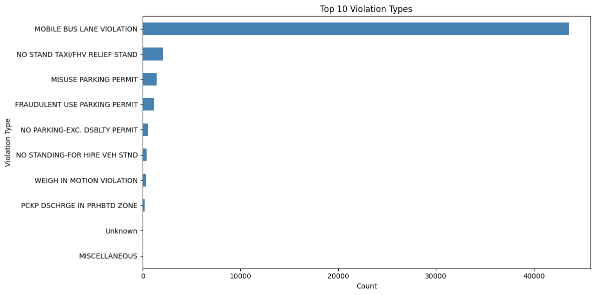
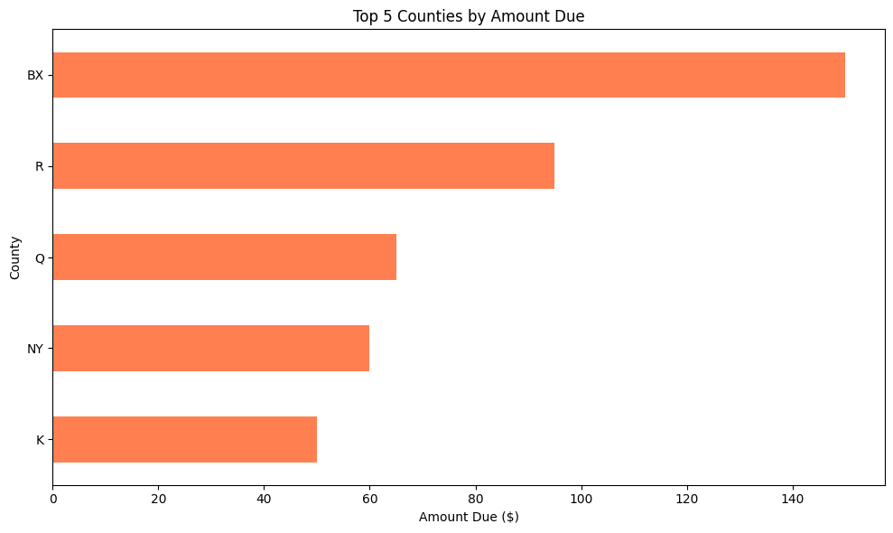
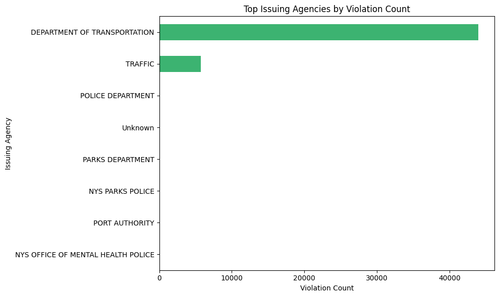
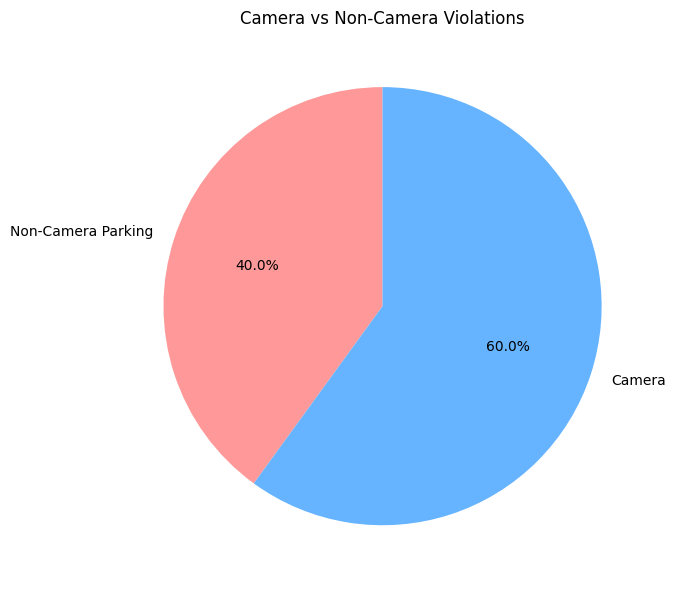

# NYC-Open-Parking-Violations-Daily-Report-Pipeline

This project automates the ingestion, validation, analysis, and reporting of NYC Open Parking and Camera Violations using the NYC OpenData SODA API. The pipeline can run locally or on a daily GitHub Actions schedule, compares the latest snapshot with the previous run, performs data quality checks, calculates financial and operational KPIs, and publishes both CSV and Markdown outputs.

## Business Problem

NYC updates open parking and camera violations continuously. Analysts and hiring managers often want to see a practical project that demonstrates:

- API ingestion
- data cleaning and type conversion
- QA and validation checks
- daily reporting
- artifact persistence
- GitHub Actions automation

This repository packages those skills into a portfolio-ready daily report pipeline.

## Dataset Source

- SODA2 API Endpoint: `https://data.cityofnewyork.us/resource/nc67-uf89.json`
- SODA3 API Endpoint: `https://data.cityofnewyork.us/api/v3/views/nc67-uf89/query.json`
- Dataset: NYC Open Parking and Camera Violations

The pipeline currently uses the SODA2 JSON endpoint for ingestion and keeps the SODA3 endpoint in configuration for future expansion.

## Project Structure

```text
NYC-Open-Parking-Violations-Daily-Report-Pipeline/
├── .github/
│   └── workflows/
│       └── daily_report.yml
├── data/
│   ├── raw/
│   ├── processed/
│   │   └── history/
│   └── latest_summary.csv
├── reports/
│   └── daily_report.md
├── dashboard/
│   └── app.py
├── src/
│   ├── __init__.py
│   ├── alerts.py
│   ├── analytics.py
│   ├── charts.py
│   ├── config.py
│   ├── extract.py
│   ├── main.py
│   ├── readme_sync.py
│   ├── report.py
│   ├── transform.py
│   └── validate.py
├── tests/
│   ├── conftest.py
│   ├── fixtures_sample_payload.json
│   ├── test_api_response.py
│   ├── test_data_quality.py
│   └── test_transformations.py
├── .env.example
├── .gitignore
├── README.md
└── requirements.txt
```

## Architecture

```text
NYC OpenData API
	  ↓
Python Extraction Layer
	  ↓
Raw JSON Snapshot in data/raw/
	  ↓
Cleaning + Type Conversion
	  ↓
Data Quality Validation
	  ↓
KPI Aggregation + Day-over-Day Comparison
	  ↓
CSV Summary in data/
	  ↓
Markdown Report in reports/
	  ↓
GitHub Actions Daily Automation
```

## Tech Stack

- Python
- pandas
- requests
- python-dotenv
- pytest
- Streamlit
- GitHub Actions

## What the Pipeline Produces

Each run generates:

### Data Files
- raw JSON API payload in `data/raw/violations_YYYY-MM-DD.json`
- processed snapshot history in `data/processed/history/violations_YYYY-MM-DD.csv`
- processed snapshot history (parquet) in `data/processed/history/violations_YYYY-MM-DD.parquet`
- latest processed snapshot in `data/processed/latest_snapshot.csv`
- latest processed snapshot (parquet) in `data/processed/latest_snapshot.parquet`
- KPI summary in `data/latest_summary.csv`
- KPI summary (parquet) in `data/latest_summary.parquet`

### Reports & Visualizations
- Markdown daily report in `reports/daily_report.md`
- dated Markdown report in `reports/daily_report_YYYY-MM-DD.md`
- Chart: Top violation types in `reports/charts/top_violations.png`
- Chart: Top counties by amount due in `reports/charts/top_counties.png`
- Chart: Top agencies by violations in `reports/charts/top_agencies.png`
- Chart: Camera vs non-camera violations pie chart in `reports/charts/camera_vs_parking.png`

### Analytics Files
- daily issue trend in `data/analytics/daily_issue_trend.csv`
- weekday trend in `data/analytics/weekday_trend.csv`
- monthly trend in `data/analytics/monthly_trend.csv`
- hourly issue trend in `data/analytics/hourly_issue_trend.csv`
- rolling daily metrics in `data/analytics/rolling_daily_metrics.csv`
- top-violation time series in `data/analytics/violation_time_series.csv`
- top-agency daily trend in `data/analytics/agency_daily_trend.csv`
- run-level metrics in `data/analytics/daily_run_metrics.csv`
- anomaly detections on run-level metrics in `data/analytics/daily_metric_anomalies.csv`
- alert log in `data/analytics/alerts_log.csv`

## Daily KPIs Included

The report includes:

1. Total violations pulled
2. Total open amount due
3. Total fine amount
4. Total penalty amount
5. Total interest amount
6. Total payment amount
7. Top 10 violation types
8. Top 5 counties by amount due
9. Borough and county breakdown
10. Top issuing agencies analysis
11. Camera vs non-camera violation count
12. Biggest day-over-day changes
13. Data quality check results

## Charts & Visualizations

The pipeline automatically generates and embeds four charts in the daily report:

- **Top Violations Bar Chart**: Displays the top 10 violation types by frequency
- **Top Counties Bar Chart**: Shows the top 5 counties by total amount due
- **Top Agencies Bar Chart**: Lists the top agencies by violation count
- **Camera vs Non-Camera Pie Chart**: Visualizes the split between camera enforced and parking violations

## Borough & Agency Analysis

The daily report includes detailed breakdowns by geographic and organizational dimensions:

- **Borough & County Breakdown**: Aggregates violations by county with violation counts and total amount due
- **Issuing Agency Analysis**: Shows violation counts and amount due by the agency that issued the violation (DOT, NYPD, DEP, etc.)

These sections help identify which areas and agencies have the highest violation volumes and outstanding amounts.

## Data Quality Checks

The validation layer checks for:

- API returned data
- required columns present
- numeric fields converted successfully
- no negative `amount_due` values
- `issue_date` parsed successfully
- `summons_number` not null

## Local Setup

1. Create and activate a virtual environment.
2. Install dependencies.
3. Add your local secrets to `.env`.
4. Run the pipeline.

### Environment Variables

Copy `.env.example` to `.env` and provide values for:

- `NYC311_APP_TOKEN`
- `NYC311_SECRET_TOKEN`
- `NYC311_SODA2_ENDPOINT`
- `NYC311_SODA3_ENDPOINT`
- `NYC311_API_LIMIT`
- `NYC311_API_TIMEOUT`
- `NYC311_ALERTS_ENABLED`
- `NYC311_ALERT_WEBHOOK_URL`
- `NYC311_ALERT_PCT_CHANGE_THRESHOLD`
- `NYC311_ALERT_ABSOLUTE_COUNT_THRESHOLD`
- `NYC311_ALERT_AMOUNT_PCT_CHANGE_THRESHOLD`
- `NYC311_ALERT_ABSOLUTE_AMOUNT_THRESHOLD`

The repository is already configured to ignore `.env`, so local secrets are not committed.

### Install Dependencies

```powershell
python -m pip install --upgrade pip
pip install -r requirements.txt
```

### Run the Pipeline Against the Live API

```powershell
python src/main.py
```

### Run With Full API Pagination

```powershell
python src/main.py --paginate
```

### Run the Pipeline Offline with the Included Sample Payload

```powershell
python src/main.py --input-file tests/fixtures_sample_payload.json --report-date 2026-05-06
```

### Optional Filters

```powershell
python src/main.py --open-only
python src/main.py --camera-only
python src/main.py --limit 10000
python src/main.py --paginate
```

### Historical Backfill (Issue Date Range)

```powershell
python src/main.py --paginate --backfill-start-date 2026-01-01 --backfill-end-date 2026-01-31
```

Backfill runs also write partitioned parquet history under `data/processed/partitioned/` by both `report_date=` and `issue_date=` directories.

### Pagination

By default, the pipeline fetches up to 50,000 records in a single request. To paginate through all available records:

```powershell
python src/main.py --paginate
```

This will automatically iterate through all available data using the SODA API's offset parameter.

### Output Formats

The pipeline generates data in both CSV and Parquet formats:

- **CSV**: Human-readable, suitable for Excel/spreadsheet software
- **Parquet**: Columnar binary format, more efficient for analytics and historical partitioning

## Interactive Dashboard (Streamlit)

Run the dashboard locally after generating pipeline outputs:

```powershell
streamlit run dashboard/app.py
```

The dashboard includes:

- KPI cards (records, amount due, camera violations)
- interactive filters for violation type and county
- top-violations and top-counties tables
- daily, weekday, and category time-series charts
- hourly issue trend and top-agency daily trend views
- browsable snapshot table for QA/debugging

### Publish the Dashboard Container

This repo includes `dashboard/Dockerfile` and `.github/workflows/publish_dashboard_image.yml` to publish a dashboard image to GHCR on dashboard-related pushes.

## Alert / Notification System

The pipeline can create alerts when significant day-over-day changes are detected.

Supported triggers:

- the percentage change in total record count exceeds the threshold
- absolute net record count change exceeds the threshold
- the percentage change in open amount due exceeds the threshold
- the absolute open amount due change exceeds the threshold

Configure alerts in `.env`:

- `NYC311_ALERTS_ENABLED=true`
- `NYC311_ALERT_WEBHOOK_URL=<your_slack_or_teams_webhook>`
- `NYC311_ALERT_PCT_CHANGE_THRESHOLD=50`
- `NYC311_ALERT_ABSOLUTE_COUNT_THRESHOLD=5000`
- `NYC311_ALERT_AMOUNT_PCT_CHANGE_THRESHOLD=35`
- `NYC311_ALERT_ABSOLUTE_AMOUNT_THRESHOLD=250000`

Alerts are always logged to `data/analytics/alerts_log.csv`. If webhook settings are enabled, alerts are also posted to the webhook endpoint.

## Automated README Updates

Each pipeline run updates a `Latest Automated Run` section in `README.md` with current KPI highlights and chart references. The GitHub Actions workflow commits these README updates automatically.

## Testing

Run the automated test suite with:

```powershell
pytest
```

The tests cover:

- API query parameter generation
- required field presence
- data quality failure detection
- numeric conversion and deduplication
- KPI aggregation
- day-over-day snapshot comparison

## GitHub Actions Automation

The workflow in `.github/workflows/daily_report.yml` runs on every push, on a daily schedule, and via manual execution.

It performs the following steps:

1. checks out the repository
2. installs dependencies
3. runs tests
4. runs the daily pipeline
5. uploads report artifacts
6. commits updated `data/` and `reports/` outputs back to the repository

### Required GitHub Secrets

Add these repository secrets before enabling the scheduled workflow:

- `NYC311_APP_TOKEN`
- `NYC311_SECRET_TOKEN`

Optional for alert notifications:

- Secret: `NYC311_ALERT_WEBHOOK_URL`
- Variable: `NYC311_ALERTS_ENABLED`
- Variable: `NYC311_ALERT_PCT_CHANGE_THRESHOLD`
- Variable: `NYC311_ALERT_ABSOLUTE_COUNT_THRESHOLD`
- Variable: `NYC311_ALERT_AMOUNT_PCT_CHANGE_THRESHOLD`
- Variable: `NYC311_ALERT_ABSOLUTE_AMOUNT_THRESHOLD`

## Example Report Contents

The Markdown report includes:

- executive summary
- top violation types table
- top counties table
- biggest day-over-day change table
- data quality results table
- QA notes section

## Why This Project Stands Out

This project is portfolio-ready because it demonstrates:

- practical API ingestion
- repeatable daily automation
- test coverage and QA thinking
- reporting and stakeholder-friendly outputs
- snapshot comparison for trend analysis

<!-- LATEST_RUN_START -->
## Latest Automated Run

- Report Date: 2026-05-15
- Total Records Pulled: 50,000
- Open Amount Due: $636.94
- New Records Pulled: 12
- Net Record Change: 0
- Quality Checks Passed: 5
- Quality Checks Failed: 1

### Quality Check Failures

- **issue_date parsed successfully**: Rows with invalid issue_date: 98

### Latest Charts






Latest report file: `/home/runner/work/NYC-Open-Parking-Violations-Daily-Report-Pipeline/NYC-Open-Parking-Violations-Daily-Report-Pipeline/reports/daily_report.md`
<!-- LATEST_RUN_END -->


## Future Enhancements

- export to cloud storage (S3, GCS)
- deploy dashboard to managed runtime (e.g., Streamlit Cloud, Azure Container Apps)
- add advanced anomaly ensembles (seasonality-aware and isolation-based methods)
